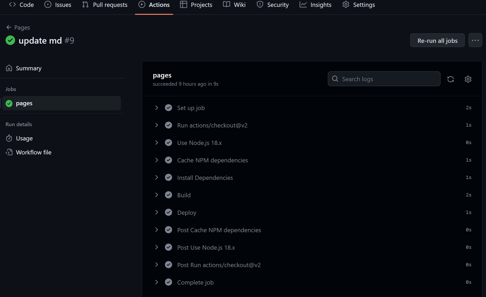

# 总结与反思

## 一、实验目的

​	本次实验使用Hexo'+Github Actions部署一个静态网页博客。Hexo是一款基于Node.js的静态博客框架，依赖少易于安装使用，可以方便的生成静态网页托管在GitHub，是搭建博客的首选框架，且因为Hexo的创建者是台湾人，对中文的支持很友好，可以查看中文文档。

**<!-- more -->**

## 二、实验步骤

1. 安装Git
2. 安装Node.js
3. 安装Hexo
4. 编写github actions
5. 推送到github
6. 发布文章

## 三、实验过程

环境搭建过程不多赘述，主要记录一下如何使Github Actions实现自动部署。

### Github Actions 简介

Github Actions可以帮助做到当我们将代码提交到 master 时，测试、部署等等所有工作自动执行。Github Actions有关术语如下：

（1）**workflow** ：持续集成一次运行的过程，就是一个 workflow。
（2）**job**：一个 workflow 由一个或多个 jobs 构成，含义是一次持续集成的运行，可以完成多个任务。
（3）**step**：每个 job 由多个 step 构成，一步步完成。 一个工作中的每个步骤都在相同的虚拟环境中执行，从而允许使用文件系统共享信息。
（4）**action** ：每个 step 可以依次执行一个或多个命令（action）。 你可以创建自己的action、使用 GitHub 社区共享的action。

### 使用Github Actions部署至 GitHub Pages

在本次实验实际应用中，我们首先需要建立名为 < GitHub 用户名>.github.io的储存库，并在储存库的 .github/workflows/目录下创建一个.yml的github Actions 的配置文件，最后将 Hexo 文件夹中的文件 push 到储存库的默认分支即可完成自动部署。

以下是我的github Actions 的配置文件，简单解释一下，即首先checkout 出来我们的代码到容器，这些actions都有人写了我们直接用就好，然后加载 uses: actions/setup-node@v2的环境，也就是支持了node.js的环境，然后再Cache NPM dependencies和Install Dependencies，最后使用peaceiris/actions-gh-pages@v3来部署，部署作业完成后，产生的页面会放在储存库中的 gh-pages分支。

```yml
name: Pages

on:
  push:
    branches:
      - master # default branch

jobs:
  pages:
    runs-on: ubuntu-latest
    permissions:
      contents: write
    steps:
      - uses: actions/checkout@v2
      - name: Use Node.js 18.x
        uses: actions/setup-node@v2
        with:
          node-version: "18"
      - name: Cache NPM dependencies
        uses: actions/cache@v2
        with:
          path: node_modules
          key: ${{ runner.OS }}-npm-cache
          restore-keys: |
            ${{ runner.OS }}-npm-cache
      - name: Install Dependencies
        run: npm install
      - name: Build
        run: npm run build
      - name: Deploy
        uses: peaceiris/actions-gh-pages@v3
        with:
          github_token: ${{ secrets.GITHUB_TOKEN }}
          publish_dir: ./public
```

Github Actions 截图



## 四、实验总结

​	博客主题我选择了Next，一个简洁清晰的主题。通过theme/_config.yml 简单修改了相关功能和样式，如增加博客主页logo，作者头像，导航栏菜单，链接等等，总体上符合简约直观的美学考量。

​	博客制作过程中并无什么问题，环境搭建十分简单。在使用Github Actions时遇到了很多问题，比如actions成功，静态网页文件成功生成，但是网站并没有成功部署，后来查阅官方文档，发现需要在储存库中将 Settings > Pages > Source 中的 branch 改为存放静态文件的分支。
